In this section we build a Data Warehouse on Microsoft Fabric. We build the Slowly Changing Dimension Type 2 with DBT. We will be following the medallion architecture for the project.<br/>

**Bronze Layer**

The key element of the build are below.<br/>

1. We bulk import the tables from tables in SQL server as parquet files into a Microsoft Fabric Lakehouse name bronze.\

We create a JSON config file which defines all the tables we will be importing. This file will act as central control to add and remove table to the bulk import and will be stored in the files section of the lakehouse. The JSON structure is:<br/>

```
{
  "sourceSystem": "FameSell",
  "tables": [
    {
      "schema": "dbo",
      "tableName": "Customers",
      "parquetName": "customers",
      "deltaSchema": "famesell",
      "deltaName": "bt_fs_customers",
      "deltaNotebook": "bt_fs_customers",
      "source_updated_at": "ValidFrom",
      "source_businesskey": "CustomerID",
      "is_enabled": true,
      "ingestion_method": "fullload"
    },
    {
      "schema": "dbo",
      "tableName": "Orders",
      "parquetName": "orders",
      "deltaSchema": "famesell",
      "deltaName": "bt_fs_orders",
      "deltaNotebook": "bt_fs_orders",
      "source_updated_at": "LastEditedWhen",
      "source_businesskey": "OrderID",
      "is_enabled": true,
      "ingestion_method": "fullload"
    },
	{
      "schema": "dbo",
      "tableName": "Supplier",
      "parquetName": "suppliers",
      "deltaSchema": "famesell",
      "deltaName": "bt_fs_suppliers",
      "deltaNotebook": "bt_fs_suppliers",
      "source_updated_at": "ValidFrom",
      "source_businesskey": "SupplierId",
      "is_enabled": true,
      "ingestion_method": "fullload"
    },
	{
      "schema": "dbo",
      "tableName": "Product",
      "parquetName": "products",
      "deltaSchema": "famesell",
      "deltaName": "bt_fs_products",
      "deltaNotebook": "bt_fs_products",
      "source_updated_at": "ValidFrom",
      "source_businesskey": "ProductID",
      "is_enabled": true,
      "ingestion_method": "fullload"
    },
	{
      "schema": "dbo",
      "tableName": "Continents",
      "parquetName": "continents",
      "deltaSchema": "famesell",
      "deltaName": "bt_fs_continents",
      "deltaNotebook": "bt_fs_continents",
      "source_updated_at": "updated_at",
      "source_businesskey": "Country",
      "is_enabled": true,
      "ingestion_method": "fullload"
    }
  ]
}
```

2. We create a pipeline in Microsoft Fabric.

- 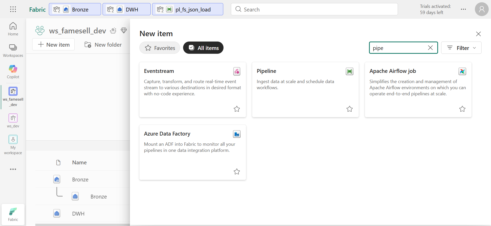

3. we add a lookup activity to the pipeline and add the config file to it as shown.

- 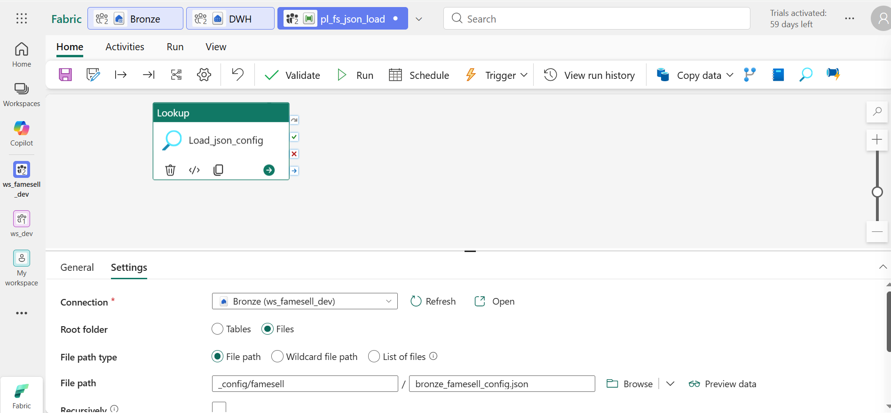

4. We add a ForEach activity to the pipeline and add the config shown.

- 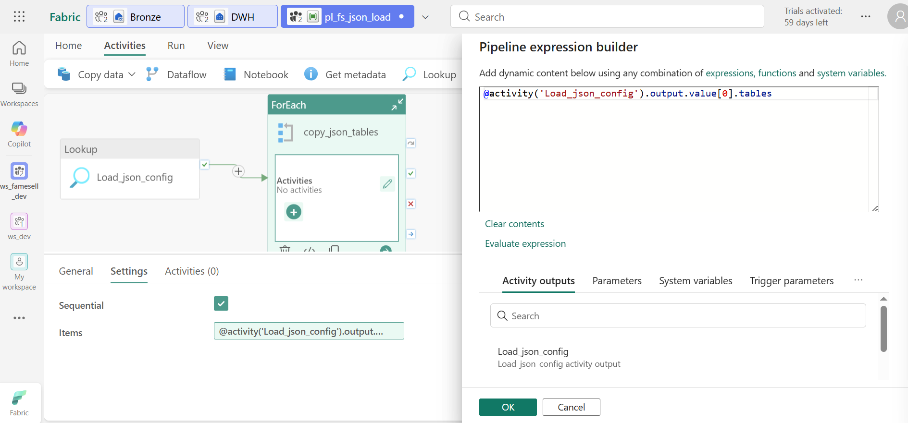

5. We add an if condition activity inside the ForEach activity and add the config shown. The is_enabled is used from the JSON control file to determine where to import a table or not.

- 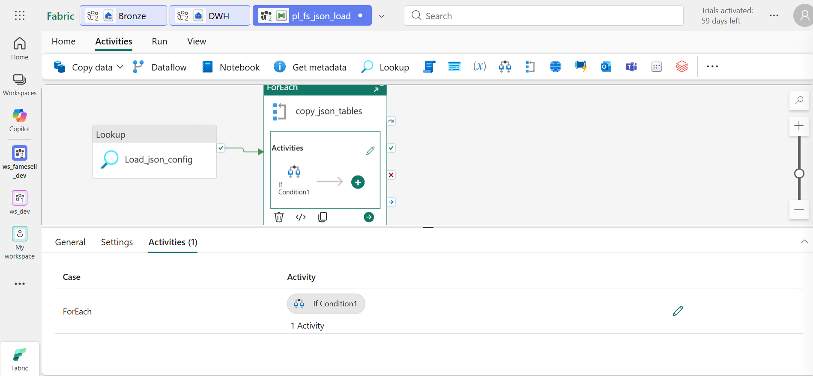
- 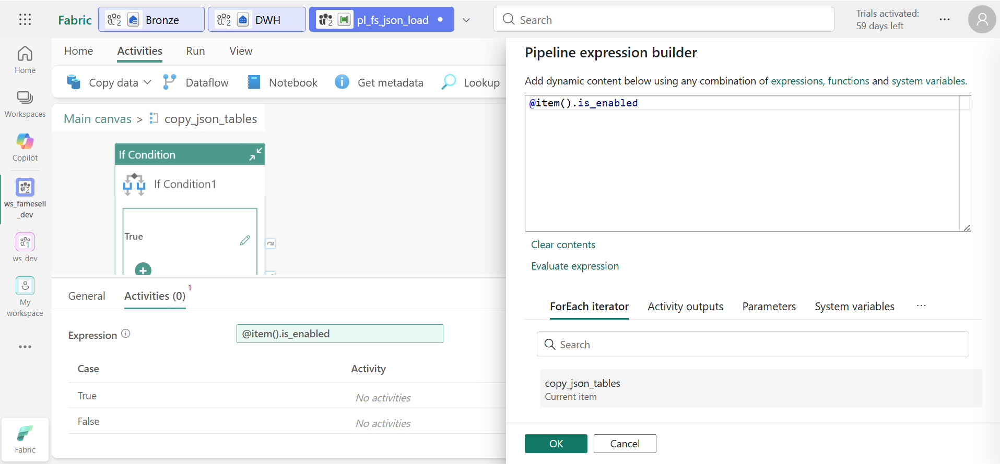

6. We add a copy activity into the ForEach activity and configure it as shown
   add additional columns for auditing and SCD downstream activities.

- 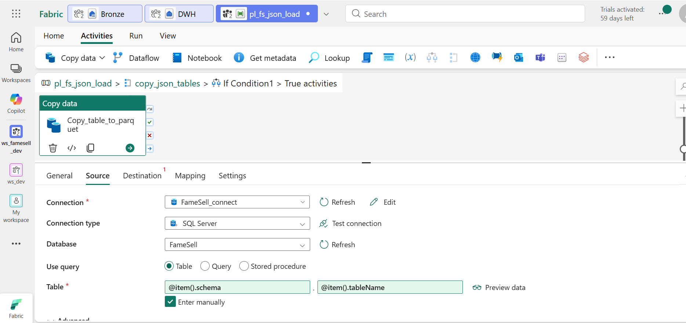
- 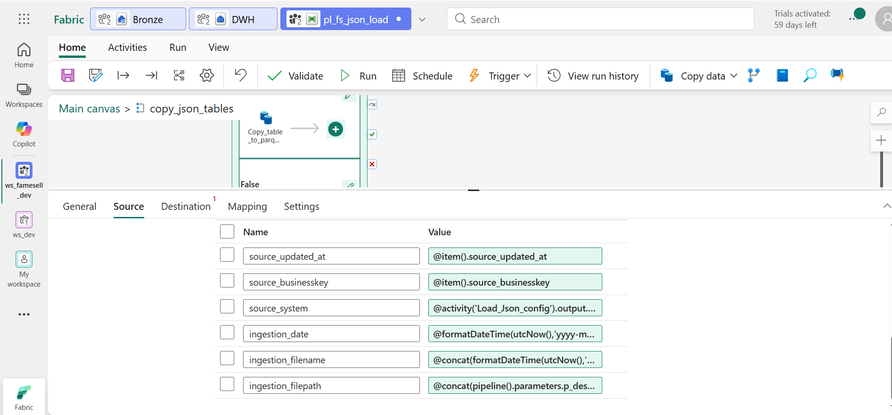
  - File Path is defined as

  ```
  @concat(pipeline().parameters.p_destination_root,'/', pipeline().parameters.p_source_system, '/', item().parquetName, '/ingestion_method=',item().ingestion_method, '/ingestion_year=', formatDateTime(utcNow(),'yyyy'), '/ingestion_month=', formatDateTime(utcNow(),'MM'), '/ingestion_day=', formatDateTime(utcNow(),'dd') )

  ```

  - and the file name

  ```
  @concat(formatDateTime(utcNow(),'yyyyMMdd_HHmmss'),'_',item().parquetName,'.parquet')

  ```

7. Add email notification if an email server is configured

- 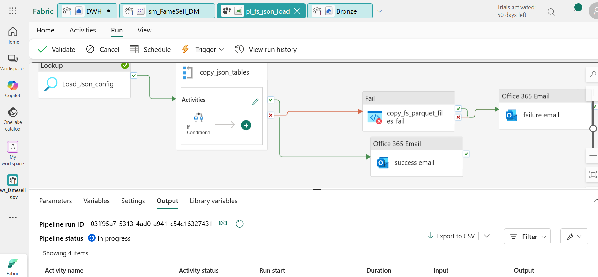

successful pipeline run for data load

- 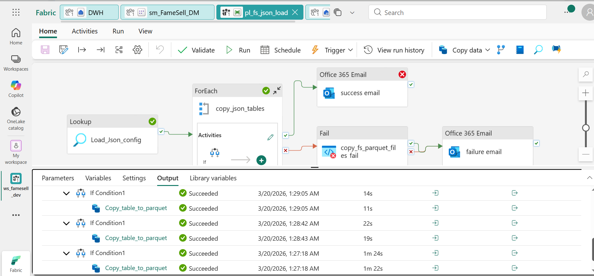

Lakehouse file structure after successful pipeline run

- 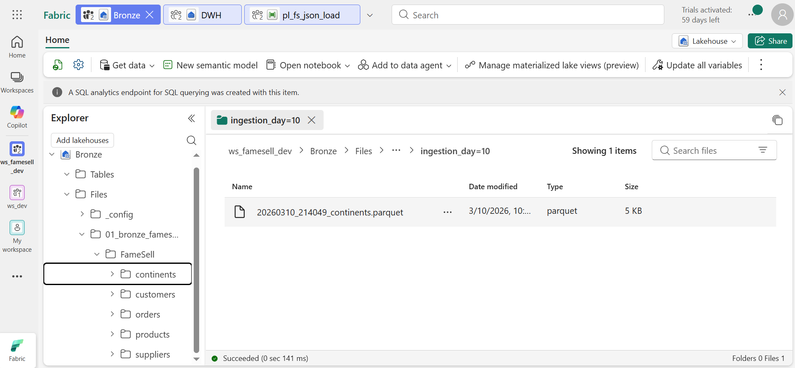

**Silver Layer**

1. Create a warehouse in Microsoft Fabric.
2. Create silver and gold schemas.
3. Create a Python virtual environment and the DBT core and DBT fabric adapter.

```
python -m pip install dbt-core dbt-fabric

```

4. Create a Service Principal in Microsoft Azure.

5.Create a DBT project

6. Add the following code to your profile.yml file (substitue values for variables if needed).

```
fabric_warehouse:
  target: prod
  outputs:
    prod:
      type: fabric
      driver: "ODBC Driver 18 for SQL Server"
      server: "{ { env_var('NEW-DBT-FABRIC-SERVER') } }"
      port: 1433
      database: "DWH"
      method: spark
      schema: silver
      authentication: ServicePrincipal
      tenant_id: "{ { env_var('NEW-DBT-FABRIC-TENANT-ID') } }"
      client_id: "{ { env_var('NEW-DBT-FABRIC-CLIENT-ID') } }"
      client_secret: "{ { env_var('NEW-DBT-FABRIC-CLIENT-SECRET') } }"
      threads: 4
      timeout: 300
      retries: 1
```

7. Add YAML source file to the models directory and add the bronze lakehouse as source. Add validation rules and description for tables as required (see sample).

```
#Apply source validation tests
sources:
  - name: landing
    description: The Fabric lakehouse for landing files and tables
    database: bronze
    schema: dbo
    #Testing for data freshness - Global/Set at table level for more granularity
    freshness:
      warn_after: { count: 1, period: day }
      error_after: { count: 3, period: day }
    loaded_at_field: ValidFrom
    tables:
      - name: cust
        description: The customers table in the landing lakehouse
        identifier: bt_fs_customers
        columns:
          - name: CustomerID
            tests:
              - not_null
              - unique
              #- dbt_expectations.expect_column_to_exist
          - name: CustomerLastName
            tests:
              - not_null
              - test_string_not_empty
          - name: CustomerFirstName
            tests:
              - not_null
              - test_string_not_empty
          - name: PhoneNumber
            tests:
              - not_null
              - test_string_not_empty
          - name: FaxNumber
            tests:
              - not_null
              - test_string_not_empty
          - name: Email
            tests:
              - not_null
              - test_string_not_empty
              - unique
          - name: Address
            tests:
              - not_null
              - test_string_not_empty
          - name: City
            tests:
              - not_null
              - test_string_not_empty
          - name: State
            tests:
              - not_null
              - test_string_not_empty
          - name: Zip
            tests:
              - not_null
              - test_string_not_empty
          - name: Country
            tests:
              - not_null
              - test_string_not_empty
          - name: ValidFrom
            tests:
              - not_null
```

8. Create a snapshot to perform the SCD type 2 for the table in the silver layer. Key components:\

- Add end data for all records deleted at source.<br/>
- deduplicate records
- data cleansing and formatting

```



{{
  config(
    target_schema='silver',
    strategy='check',
    check_cols='all',
    unique_key='source_businesskey',
    updated_at='ingestion_date',
    invalidate_hard_deletes=True,
    schema='silver',
    alias='st_fs_customers',
    file_format='delta',

  )
}}


WITH ranked_source AS (

SELECT
        CustomerID,
        CustomerFirstName,
        CustomerLastName,
        PhoneNumber,
        FaxNumber,
        Email,
        Address,
        City,
        State,
        Zip,
        Country,
        source_updated_at,
        source_businesskey,
        source_system,
        ingestion_date,
        cast(ingestion_year as int)  as ingestion_year,
        cast(ingestion_month as int) as ingestion_month ,
        cast(ingestion_day as int) as ingestion_day,
        ROW_NUMBER() OVER (PARTITION BY [source_businesskey],[source_system] ORDER BY [ingestion_date] DESC,[source_updated_at] DESC) AS [dbt_row_num]
    FROM {{ source('landing', 'cust') }}

/* DATA CLEANSING, FORMATTING, DEDUPLICATION */


) SELECT
    *
  FROM
    ranked_source
  WHERE
    [dbt_row_num] = 1



```

Output of silver layer table

- 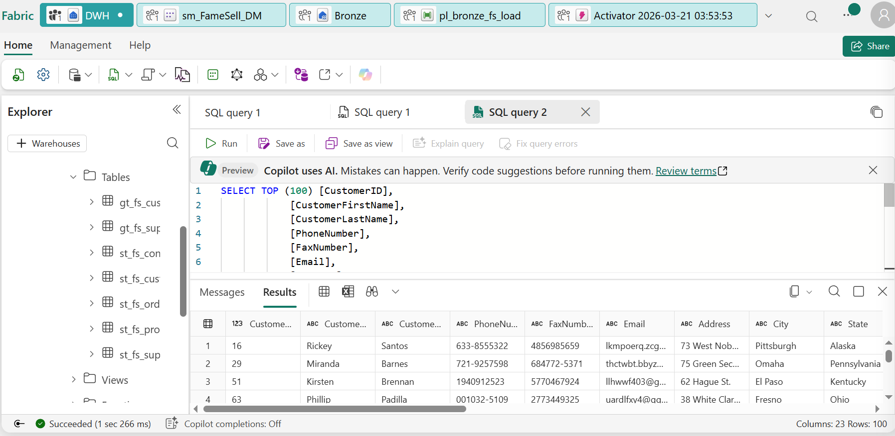

9. For fact tables we create an incremental table in the models section of the project

```
{{
  config(
    materialized='incremental',
    unique_key='OrderID'
  )
}}


WITH ranked_source AS (


    SELECT
        *,
        ROW_NUMBER() OVER (PARTITION BY [source_businesskey],[source_system] ORDER BY [ingestion_date] DESC,[source_updated_at] DESC) AS [dbt_row_num]
    FROM {{ source('landing', 'orders') }}

/* DATA CLEANSING, FORMATTING, DEDUPLICATION */


) SELECT
    *
  FROM
    ranked_source


    where LastEditedWhen > (select coalesce(max(LastEditedWhen),'1900-01-01 00:00:00') from {{ this }})
    and [dbt_row_num] = 1

```

**Gold layer**

1. We install the DBT util package (dbt-labs/dbt_utils).<br/>
2. We create a macro to use as a post hook to update statistics after a table load.<br/>

```
#-- Pass the table name, statistics name, and column name on which to create the statistic --#}
{#-- Pass the table name, statistics name, and column name on which to create the statistic --#}

    {#-- Check for full refresh flag and create statistics if table is being dropped --#}
    {#-- Otherwise, update statistic --#}
    
        
            CREATE STATISTICS {{ statistics_name }} on {{ table_name }} ({{ column_name }}) WITH FULLSCAN;


    
        
            UPDATE STATISTICS {{ table_name }}({{ statistics_name }}) ;


    

    
    


```

3. We create a micro to assist with the gold date table creation (marcro create a sequence of dates between to specified dates).\

```

    SELECT dates = DATEADD(DAY,[value] - 1,{{ start_date }})
    FROM GENERATE_SERIES(
           1
          ,DATEDIFF(DAY
                   ,{{ start_date }}
                   ,{{ end_date }}) + 1
          ,1)


```

4. We create an incremental model in the models folder of the project. Key highlights are:<br/>

- Add the post hook to the config section to create or update the table statistics.
- Create surrogate key for the table - use a hash of the business key, source system and valid from columns for uniqueness.
- Set sentinel value (future end value) to valid_to columns.
- Add a dummy record on table creation for fact table records without business key in the fact table.

```
{{ config(
    materialized='incremental',
    unique_key='sk_fs_customer',
    incremental_strategy='delete+insert',
    schema='gold',
    alias='gt_fs_customers',
    post_hook="{{update_statistics(this,'CustomerStatistics','sk_fs_customer')}}"
) }}


WITH snapshot_table AS (
	SELECT
        HASHBYTES('SHA2_256',{{ dbt_utils.generate_surrogate_key(['driving.source_businesskey', 'driving.source_system', 'driving.dbt_valid_from']) }}) AS sk_fs_customer,
        HASHBYTES('SHA2_256',{{ dbt_utils.generate_surrogate_key(['driving.source_businesskey', 'driving.source_system']) }}) AS sk_fs_customer_master,
        driving.source_system AS dbt_id_sourcesystem,
        driving.source_businesskey AS dbt_id_business_key,
        CAST(
            CASE
                WHEN driving.dbt_valid_to IS NULL THEN 1
                ELSE 0
            END AS BIT) AS dbt_current_flag,
        CAST(driving.dbt_valid_from AS DATE) AS dbt_valid_from,
        CAST(COALESCE(driving.dbt_valid_to, '3000-12-31') AS DATE) AS dbt_valid_to,
        CAST(driving.dbt_valid_from AS DATE) AS mod_valid_from,
        CAST(CASE
                WHEN driving.dbt_valid_to IS NULL
                THEN '3000-12-31'
             ELSE DATEADD(DAY, -1, driving.dbt_valid_to)
        END AS DATE) AS mod_valid_to,
		CAST(driving.dbt_updated_at AS DATE) AS dbt_updated_at,
        CustomerFirstName,
        CustomerLastName,
        PhoneNumber,
        FaxNumber,
        Email,
        Address,
        City,
        State,
        Zip,
        Country
	FROM {{ ref('st_fs_customers') }} driving

    
        -- Only pull new records since the last run
        WHERE dbt_updated_at > (
        SELECT MAX(dbt_updated_at)
        FROM {{ this }}
        WHERE dbt_id_business_key != -1
        )
    

    
        --Add only dummy record
    Union ALL

	SELECT
        -- dummy record for artifical foreign keys
        -1  AS sk_fs_customer,
        -1  AS sk_fs_customer_master,
        'N/A'  AS dbt_id_sourcesystem,
        -1  AS dbt_id_business_key,
        1  AS dbt_current_flag,
        CAST('1900-01-01' AS DATE) AS dbt_valid_from,
        CAST('3000-12-31' AS DATE) AS dbt_valid_to,
        CAST('1900-01-01' AS DATE) AS mod_valid_from,
        CAST('3000-12-31' AS DATE) AS mod_valid_to,
		CAST('1900-01-01' AS DATE) AS dbt_updated_at,
        'N/A' AS CustomerFirstName,
        'N/A' AS CustomerLastName,
        'N/A' AS PhoneNumber,
        'N/A' AS FaxNumber,
        'N/A' AS Email,
        'N/A' AS Address,
        'N/A' AS City,
        'N/A' AS State,
        'N/A' AS Zip,
        'N/A' AS Country

      
)
    select
        sk_fs_customer,
        sk_fs_customer_master,
        dbt_id_sourcesystem,
        dbt_id_business_key,
        dbt_current_flag,
        dbt_valid_from,
        dbt_valid_to,
        mod_valid_from,
        mod_valid_to,
        dbt_updated_at,
        CustomerFirstName,
        CustomerLastName,
        PhoneNumber,
        FaxNumber,
        Email,
        Address,
        City,
        State,
        Zip,
        Country
    FROM snapshot_table

```

Output of gold layer table

- 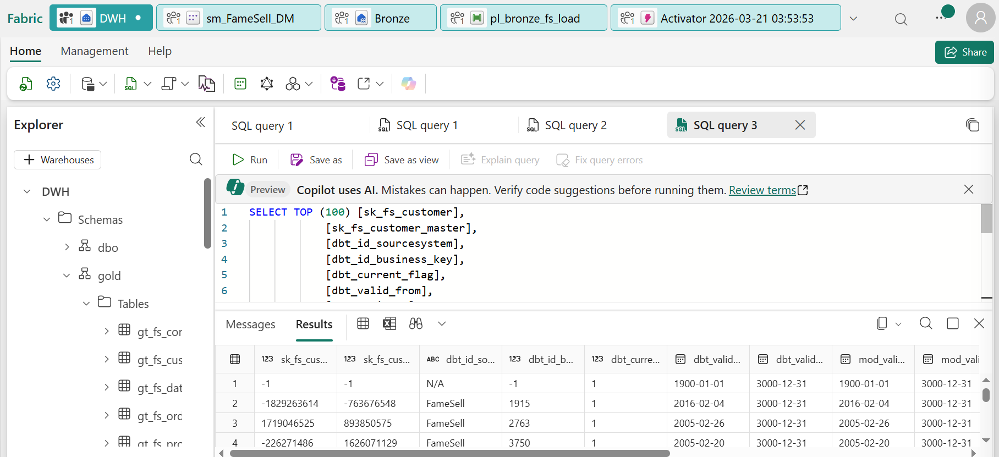

We can create a dates table in model (ideally should be a one off process and not created on every run)<br/>

- Uses date macro helper

```
{{
    config(
        materialized = "table",
        schema='gold'
    )
}}

WITH date_spine AS
( -- 103 = dd/mm/yyyy
{{ my_date_spine(
     start_date="CONVERT(DATE,'01/01/1980', 103)"
    ,end_date="DATEADD(YEAR,50,CONVERT(DATE,GETDATE(), 103))"
   )
}}
)
SELECT
   SK_Date        = dates
  ,[DateDesc]	= CONVERT(CHAR(11),dates,120)
  ,[WeekNbr]      = DATEPART(ISO_WEEK,dates)
  ,[MonthNbr]	= DATEPART(MONTH,dates)
  ,[QuarterNbr]	= DATEPART(QUARTER,dates)
  ,[Year]		= DATEPART(YEAR, dates)
  ,[DayName]		= CAST(DATENAME(WEEKDAY, dates) AS VARCHAR(20))
  ,[WeekName]	= 'W' + CAST(DATEPART(ISO_WEEK,dates) AS VARCHAR(2))
  ,[MonthName]	= CAST(DATENAME(MONTH,dates) AS VARCHAR(20))
  ,[QuarterName]	= 'Q' + CAST(DATEPART(QUARTER,dates) AS CHAR(1))
  ,[YearWeek]	= CAST(DATEPART(YEAR, dates) AS CHAR(4)) +
                       RIGHT('0' + CAST(DATEPART(ISO_WEEK, dates) AS VARCHAR(2)),2)
  ,[YearWeekDesc] = CAST(DATEPART(YEAR, dates) AS CHAR(4)) + ' W' + CAST(DATEPART(ISO_WEEK,dates) AS VARCHAR(2))
  ,[YearMonth]	= CAST(DATEPART(YEAR, dates) AS CHAR(4)) +
                        SUBSTRING(CONVERT(VARCHAR(6),dates,112),5,2)
  ,[YearMonthDesc] = CAST(DATEPART(YEAR, dates) AS CHAR(4)) + '-' +
                         RIGHT('0' + CAST(DATEPART(MONTH, dates) AS VARCHAR(2)),2)
  ,[YearMonthDescFull]	= CAST(DATENAME(MONTH,dates) AS VARCHAR(20)) + ' ' + CAST(DATEPART(YEAR, dates) AS CHAR(4))
  ,[YearQuarter]	= CAST(DATEPART(YEAR, dates) AS CHAR(4)) + CAST(DATEPART(QUARTER, dates) AS CHAR(1))
  ,[YearQuarterDesc] = CAST(DATEPART(YEAR, dates) AS CHAR(4)) + ' ' +
                             'Q' + CAST(DATEPART(QUARTER,dates) AS CHAR(1))
  ,[IsMonthFirstDay] = IIF(dates = DATEADD(MONTH, DATEDIFF(MONTH, 0, dates), 0), 'yes', 'no' )
  ,[IsMonthLastDay] = IIF(dates = EOMONTH(dates,0),'yes','no')
  ,[MonthFirstDay] = DATEADD(DAY,1,EOMONTH(dates,-1))
  ,[MonthLastDay]	 = EOMONTH(dates,0)
  ,[DayOfWeek]	 = DATEPART(WEEKDAY, dates)
  ,[DayOfMonth]	 = DATEPART(DAY, dates)
  ,[DayOfQuarter]	 = DATEDIFF(DAY,DATEADD(QUARTER,DATEDIFF(QUARTER,0,dates),0),dates) + 1
  ,[DayOfYear]	 = DATEPART(DAYOFYEAR, dates)
FROM date_spine d;
```

**Finally we can create a Semantic Model on the gold tables for reports**

- 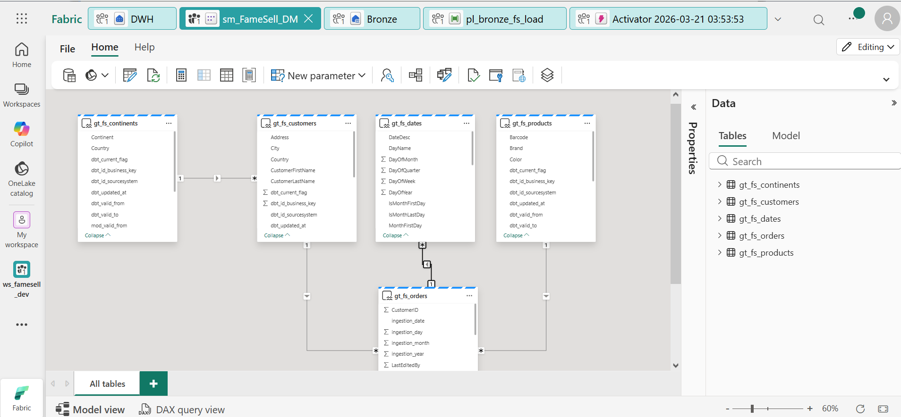
